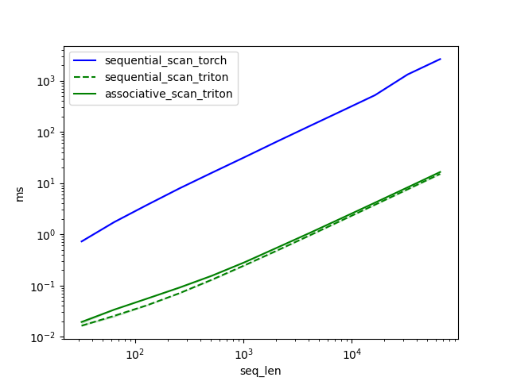

# Linear RNN (Triton)

## Installation

The repository uses [Poetry](https://python-poetry.org/docs/) to manage dependencies. To install dependencies for the
entire package, run:

```shell
cd $HOME; git clone https://github.com/TushaarGVS/linear-rnn.git
cd $HOME/linear-rnn

poetry install
```

To run the package in an editable mode, run:

```shell
pip install -e .
```

__Note.__ The pacakge uses `triton-3.0.0` which needs to be installed from source (and is also not compatible with
`torch=2.2.2`).

---

## Benchmarking

To benchmark the RNN scan, run:

```shell
cd $HOME/linear-rnn; python linear_rnn/benchmarking/rnn_scan.py
```

The RNN scan benchmarking results (from running on an A6000 GPU) for sequences of length 32 to 131K (batch size: 4, dim:
5,120) are recorded in
[`linear_rnn/benchmarking/results/rnn_scan`](https://github.com/TushaarGVS/linear-rnn/blob/main/linear_rnn/benchmarking/results/rnn_scan):


