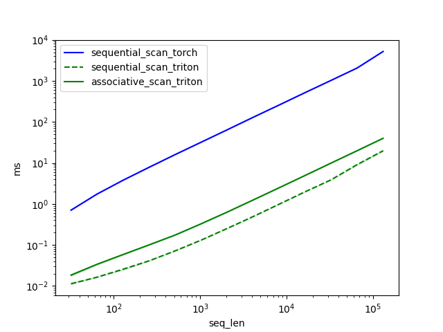
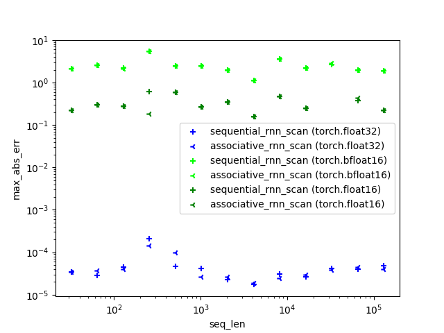

# Linear RNN (Triton)

## Installation

The repository uses [Poetry](https://python-poetry.org/docs/) to manage dependencies. To install dependencies for the
entire package, run:

```shell
cd $HOME; git clone https://github.com/TushaarGVS/linear-rnn.git
cd $HOME/linear-rnn

poetry install
```

To run the package in an editable mode, run:

```shell
pip install -e .
```

__Note.__ The pacakge uses `triton-3.0.0` which needs to be installed from source (and is also not compatible with
`torch=2.2.2`).

---

## Running

```python
import torch

from linear_rnn.triton.associative_rnn_scan import associative_rnn_scan
from linear_rnn.triton.sequential_rnn_scan import sequential_rnn_scan, rnn_scan_ref

batch, seq_len, dim = 8, 1024, 2560
x = torch.randn(batch, seq_len, dim, device="cuda", dtype=torch.float16)
a = torch.randn(batch, seq_len, dim, device="cuda", dtype=torch.float16)

rnn_scan_ref_out = rnn_scan_ref(x, a)
sequential_rnn_scan_tt_out = sequential_rnn_scan(x, a)
associative_rnn_scan_tt_out = associative_rnn_scan(x, a)

torch.allclose(sequential_rnn_scan_tt_out, rnn_scan_ref_out, atol=0.125, rtol=0)
torch.allclose(associative_rnn_scan_tt_out, rnn_scan_ref_out, atol=0.125, rtol=0)
```

---

## Benchmarking

__Note.__ The reference implementation: `linear_rnn.triton.sequential_rnn_scan.rnn_scan_ref` is completely unoptimized
and is only used to compare the correctness of the implementations.

### Efficiency

To benchmark the efficiency of RNN scan, run:

```shell
cd $HOME/linear-rnn; python linear_rnn/benchmarking/rnn_scan_efficiency.py
```

The RNN scan benchmarking results (from running on an A6000 GPU) for sequences of length 32 to 131K (batch size: 4, dim:
5,120) are recorded in
[`linear_rnn/benchmarking/results/rnn_scan`](https://github.com/TushaarGVS/linear-rnn/blob/main/linear_rnn/benchmarking/results/rnn_scan):



### Precision

To benchmark the precision of RNN scan, run:

```shell
cd $HOME/linear-rnn; python linear_rnn/benchmarking/rnn_scan_precision.py
```

The RNN scan benchmarking results (from running on an A6000 GPU) for sequences of length 32 to 131K (batch size: 4, dim:
5,120):


